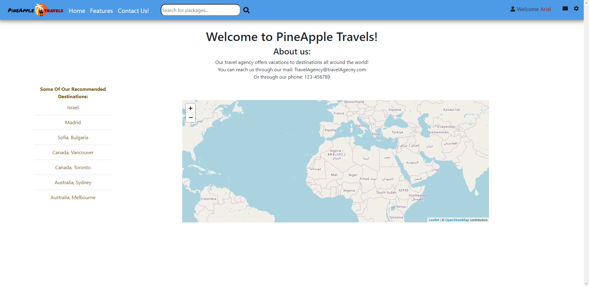

# Pine Apple Travel Agency (Website)
> This repo includes the third sprint of software project management course.

## Table of contents
* [General info](#general-info)
* [Status](#status)
* [Setup](#setup)
* [Technologies](#technologies)
* [Features](#features)
* [Code example](#code-example)
* [Screenshots](#screenshots)
* [Contact](#contact)

## General info
The given website by the end of the course will provide a platform for travelers
to find their perfect resort location and book a trip using our services.
The server side based on two parts which serving us in production and development environments respectively.
The server side includes root file (Called app.js) in both enviroments. the app.js file forked to 
routers to make our code much modular and simplier, the division to routers based on the idea that
each functionality has it's own router which handles the http request and respondes in the server.
The frontend based on React.js. when new version is done, npm run build command run to make shrinked 
static version of the frontend code which helps to deploy the website to Heroku via one and only port.

## Status
Project is: _in progress_.
The branch master up to date according to the submission of Sprint #4.


## Setup

### Dependencies
Pre-Installation requirements:
* `node v14.13.1`
* `npm v6.14.8`

### Installation Guide
*  In your terminal use the following commands:
1. Clone the repo using `git clone git@github.com:JustSage/project-management.git`.
2. Run the command `npm i | npm install` to install all dependencies.
3. You may use `npm run dev` to run the development environment,or `npm run start` to run the production environment.
4. The website can now be view from http://localhost:3000 or 3001.

## Technologies
* Frameworks - Node.js, React.js
* Backend - based on Express.js
* Testing - Jest
* Database - MongoDB
* Communication between client and server - based on Axios

## Code Example
* Server side using express:

- App source script - exported to the production and development servers script
```javascript
const express = require('express')
require('./database/mongoclient')
const userRouter = require('./routers/user')
const adminRouter = require('./routers/admin')
const pacakgeRouter = require('./routers/package')
const customersRouter = require('./routers/customers')
const orderRouter = require('./routers/order')
const cors = require('cors')
const bodyParser = require('body-parser')

const app = express()

app.use(bodyParser.json())
app.use(userRouter)
app.use(adminRouter)
app.use(pacakgeRouter)
app.use(customersRouter)
app.use(orderRouter)
app.use(cors())

module.exports = app

```

- app-dev.js (development):

```javascript
const app = require('./app-source')
const express = require('express')
const path = require('path')
const publicDirectoryPath = path.join(__dirname, '../public')
app.use(express.static(publicDirectoryPath))

const port = process.env.PORT || 3001

app.get('/', (req, res) => {
	res.sendFile('index.html')
})

app.listen(port, () => {
	console.log(`App is listen to port ${port}`)
})

module.exports = app


```
- app.js (production):

```javascript
const app = require('./app-source')
const path = require('path')
const express = require('express')

const port = process.env.PORT || 3001

app.use(express.static(path.join(__dirname, 'build')))

app.get('/*', (req, res) => {
	res.sendFile(path.join(__dirname, 'build', 'index.html'))
})

app.listen(port, () => {
	console.log(`App is listen to port ${port}`)
})

module.exports = app

```

## Features
* Login page
* Signup page
* Homepage
* Navbar
* Admin references page
* Packages page + CRUD functionalities
* Orders & reservations pages + CRUD functionalities
* OSM Map & List with agency destinations
* Contact Us! feature
* Send email feature
* Message box

## Screenshots

Login page:


Homepage (+ Navbar):



Packages page (shrinked version):


Orders page:


## Contact

Visit our website:
[Pine Apple Travel Agency](https://pine-apple-travel-agency.herokuapp.com/ "Pine Apple Travel Agency")

Created by:
[@Sagie Baram](https://github.com/JustSage)
[@Ariel Turchinsky](https://github.com/ariel7590)
[@Yehonatan Hen](https://github.com/YehonatanHen)
[@David Haron Zade](https://github.com/Dave-Sama)
